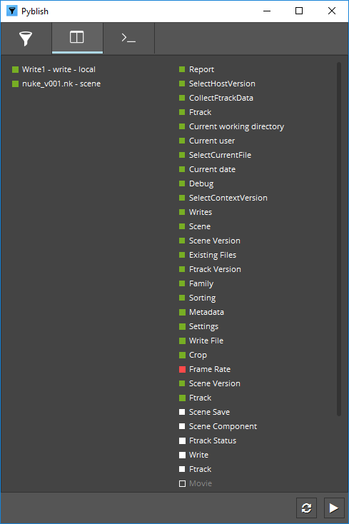
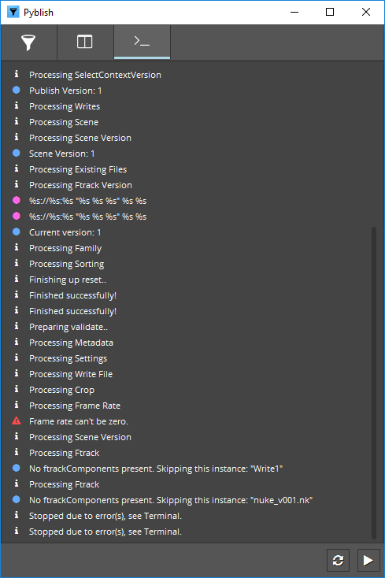
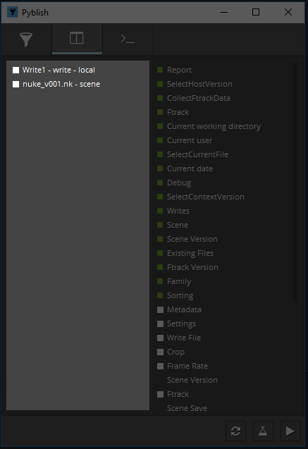

# Workflow

The workflow is the same across all applications, and follows a "Test and Repair" mentality.

## Test and Repair

Once the application is open, go to ```File > Publish```, which will bring up the UI for publishing.

Hit the ```Publish``` button  and wait for Pyblish to finish working.


Any failed validations will be marked with a red colour.


If a validation fails, try to repair it by right-clicking and choosing the "Repair" action. The repairable validations are marked with a small white "A". Once repaired successfully, the "A" icon will turn green.


If a validation does not have a repair action, have a look in the terminal for a description about why the validation is failing. Any error messages will be marked with a red icon.

 

As you can see in the above example, there is a problem with the frame rate which can't be zero.

Finally you hit ```Reset```  and try to publish again. Once all the checkboxes have turned green, you will have done a successful publish.

If the repairing fails, the "A" icon will turn red, or there is a validation that you can't fix manually please proceed to reporting.

## Reporting

If anything goes wrong with a publish you can copy a report and send it to your pipeline person.

To copy the report right-click on the ```Report``` plugin, and select ```Copy To Clipboard```.


## Output

By default only the scene will be published, so in order to publish certain parts of your scene to different formats, you'll have to setup the scene first.

The different outputs you publish can be viewed in the UI on the left side. These are called instances.



Each instance is a different output, and will result in a file on disk once successfully published. There are three different types of instances, you will encounter; ```local```, ```remote``` and ```output```.

### ```local```

This instance represents any node that will be processed on the local machine ei. the machine you publish from. They will be labelled with the name of the node like this; ```name - type - local```.

Examples:

- ```mantra1 - mantra - local```
- ```alembic1 - alembic - local```
- ```geometry1 - geometry - local```
- ```set1_alembic - alembic - local```
- ```set1_mayaAscii - mayaAscii - local```
- ```set1_mayaBinary - mayaBinary - local```
- ```defaultRenderLayer1 - renderlayer - local```

### ```remote```

This instance represents any node that will be processed remotely ei. by a render remote or other computing management like cloud computing. They will be labelled with the name of the node like this; ```name - type - remote```.

Examples:

- ```mantra1 - mantra - remote```
- ```alembic1 - alembic - remote```
- ```geometry1 - geometry - remote```
- ```set1_alembic - alembic - remote```
- ```set1_mayaAscii - mayaAscii - remote```
- ```set1_mayaBinary - mayaBinary - remote```
- ```defaultRenderLayer1 - renderlayer - remote```

### ```output```

This instance represents any nodes output that already exists ei. alembic files from an alembic node or image files from a mantra node. They will be labelled with the name of the node and the collection of files like this; ```node - collection```.

Examples:

- ```mantra1 - task_name.v001_mantra1_vm_picture.%04d.exr [1-2]```
- ```alembic1 - task_name.v001_alembic2_filename.%04d.abc [1]```
- ```geometry - task_name.v001_geometry2_sopoutput.%04d.bgeo.sc [1-2]```
- ```defaultRenderLayer1 - maya_defaultRenderLayer1.%04d.png [1-10]```
- ```set1_alembic - maya_set1_alembic.%04d.abc [1]```
- ```set1_mayaAscii - maya_set1_mayaAscii.%04d.abc [1]```
- ```set1_mayaBinary - maya_set1_mayaBinary.%04d.abc [1]```

# [BACK](index.md)
