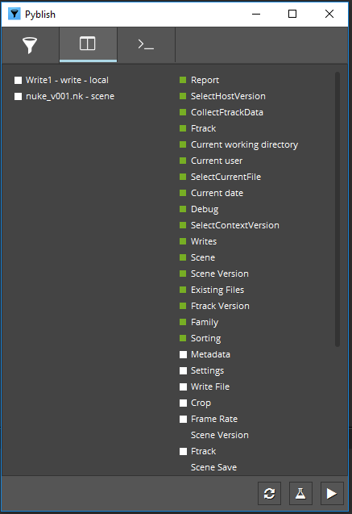
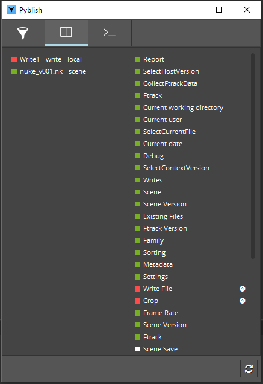
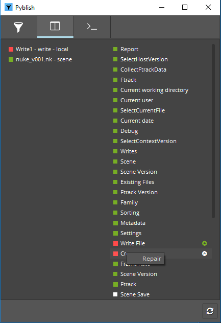

# Workflow

The workflow is the same across all applications, and follows a "Test and Repair" mentality.

## Test and Repair

Once the application is open, go to ```File > Publish```, which will bring up the UI for publishing.

Hit the ```Publish``` button (play icon) and wait for Pyblish to finish working.



Any failed validations will be marked with a red colour.



If a validation fails, try to repair it by right-clicking and choosing the "Repair" action. The repairable validations are marked with a small white "A". Once repaired successfully "A" will turn green.



If a validation does not have a repair action, have a look in the terminal for a description about why the validation is failing.

 

Finally you hit ```Reset``` (refresh icon) and try to publish again. Once all the checkboxes have turned green, you will have done a successful publish.

If the repairing fails, then "A" will turn red, or there is a validation that you can't fix manually please proceed to reporting.

### Reporting

If anything goes wrong with a publish you can copy a report and send it to your pipeline person.

To copy the report right-click on the ```Report``` plugin, and select ```Copy To Clipboard```.


#### Output

The workflow for setting up a scene for outputting different formats, varies in each application.
See the links below for how each application is supported.

Each supported application is listed below;

- [Maya](maya.md)
- [Houdini](houdini.md)
